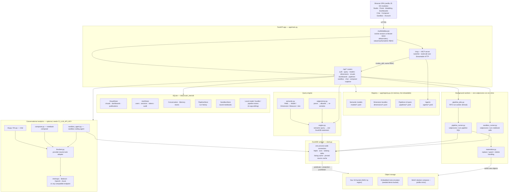
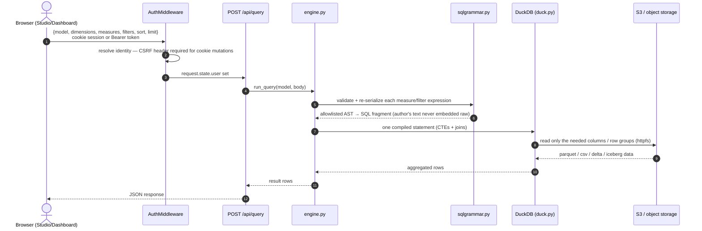
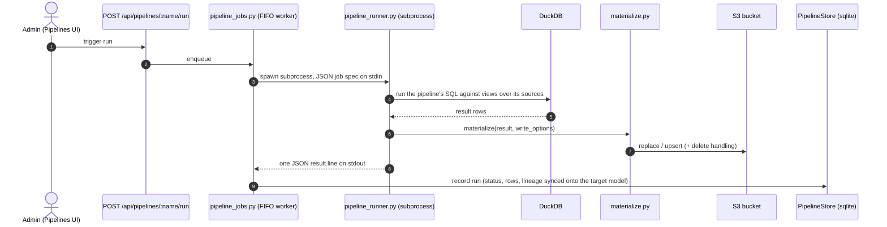

# Solution architecture

CASH_INTELLIGENCE is a single FastAPI service (one container, one process) that
turns files already sitting in S3 into a governed BI layer: a YAML semantic
layer describes sources/joins/dimensions/measures, DuckDB compiles each
request into one statement and reads the bucket in place (only the columns
and row groups a query needs leave S3), and everything a person authors —
measures, pipelines, sandbox notebooks — is SQL, parsed and allowlisted before
it ever reaches a connection. State that must survive a restart (visuals,
dashboards, users/sessions, pipeline run history, saved notebooks) lives in a
single SQLite file on a mounted volume; state that shouldn't (query results)
never touches disk at all.

This doc is a deeper, diagrammed companion to the ASCII sketch and
[Project layout](../README.md#project-layout) in the README — read those
first for the byte-level detail; this is the shape.

## Components

**Why one DuckDB connection.** Parquet-metadata caching, DuckDB's external
file cache and its keep-alive HTTP connections to S3 all live on the
*instance*, not the query — a connection per request would start cold every
time, so every reader (the query engine, pipeline runs, sandbox cells, the
sandbox agent) takes a short-lived cursor off one process-wide connection
instead (`app/duck.py`).

**Why one SQLite writer.** The demo bucket's S3 emulator and the SQLite store
both assume a single writer, which is why the Docker image runs one uvicorn
worker by design (`Dockerfile`) — scale out only against an external S3
endpoint, not by adding workers to this container.

**Why a subprocess for pipelines and sandbox runs.** A Python thread can't be
killed; a runaway or infinite-loop query can. Both run as a short-lived
`python -m app.<runner>` subprocess so a hard timeout is a real kill, and a
bad run can never take the FastAPI process down with it.

## Request flow: a query

## Request flow: a pipeline run

## Deployment topologies

All four run the same image (`Dockerfile`) with different env/volumes —
nothing about the code path changes between them:

| Topology | Command | Object storage |
|---|---|---|
| Local demo | `docker compose up` | embedded moto emulator only |
| Demo + your bucket | `CI_BUCKET=my-lake docker compose up` | emulator (demo models) + your AWS bucket, side by side |
| Demo + MinIO | `docker compose --profile minio up` | MinIO container, second app instance on :8081 |
| No Docker | `./run.sh` | same env vars, read from `.env` |

`models/`, `dimensions/` and `pipelines/` are bind-mounted from the host in
every Docker topology, so editing a YAML file — or saving one from the
in-app editor, which writes through the same `local_*` SQLite stores — is
picked up on the next `Registry.reload_all()` with no rebuild.

## Security posture that shapes the diagram

- **Default-deny at the edge.** `AuthMiddleware` guards every `/api` and
  `/mcp` route up front; a route can't opt out by forgetting a dependency,
  and the MCP handshake itself requires a valid identity — there is no
  anonymous entry point.
- **No SQL passthrough, anywhere authoring happens.** Measures, pipeline SQL
  and sandbox cells are parsed into an AST and checked against a fail-closed
  allowlist (`sqlgrammar.py`); the author's literal text never reaches the
  DuckDB connection. Table functions (`read_parquet`, `delta_scan`, …) are
  structurally unreachable from a measure — only an admin-authored pipeline
  can name a bucket path directly.
- **Credentials never cross the emulator boundary.** The demo bucket's S3
  emulator uses its own dummy key pair; a real bucket's credentials
  (`AWS_PROFILE`/SSO, static keys, or the instance/task role) are scoped to
  that bucket alone.
